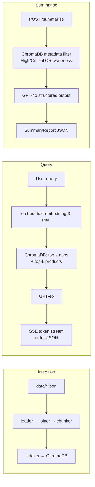

# Product Portfolio RAG

A Retrieval-Augmented Generation application for querying an enterprise application portfolio in plain English. The system ingests structured application and product records into a vector store and answers natural language questions grounded in the actual data, with streamed responses and a structured risk summary report.

## What it does

**Free-text queries** — ask any question about the estate. Responses stream token-by-token via SSE, cite the source documents used, and expose raw retrieved context for inspection.

**Guided query chips** — eight pre-written queries grouped by theme (Risk, ROI, Governance, Explore) that walk through the most analytically interesting portfolio scenarios.

**Structured risk summary** — `POST /summarise` runs an agentic pass over all high-risk and ownerless applications and returns a machine-readable `SummaryReport`: overall health rating, prioritised risk findings with recommended actions, and governance gaps.

The dataset is a fictional company (Pragmenta Insights) with 30 applications and 14 commercial products, designed to surface non-obvious risk. The centrepiece scenario is a two-hop indirect dependency — DataLicensing ($6.2m ARR) → CoreDataWarehouse → AuthService (Critical, vendor EOL Q2 2026). Transitive risk is resolved at ingestion time and stored in the product document; no multi-hop retrieval or LLM arithmetic at query time.

## Architecture



## Example queries

```
Which applications are at Critical or High risk, and what is the vendor situation?
How much revenue is exposed to the AuthService risk, directly and indirectly?
Which products have the best ROI relative to their application costs?
Which applications have no named owner?
What modernisation has happened in the last two years, and what savings did it deliver?
Are there any capability overlaps between applications that could be consolidated?
```

## Stack

| Layer | Technology |
|---|---|
| Backend | Python 3.12, FastAPI, uv |
| LLM | OpenAI GPT-4o (generation), text-embedding-3-small (embeddings) |
| Vector store | ChromaDB — local file persistence at `.chroma/` |
| Frontend | React 19, TypeScript, Vite, Tailwind CSS |
| Container | Docker multi-stage build (Node 20 → Python 3.12) |
| Cloud | Azure Container Apps, Bicep, optional Easy Auth |

No LangChain or LlamaIndex — the RAG pipeline is built directly with the OpenAI SDK and ChromaDB SDK.

## Getting started

### Docker (recommended)

Requires Docker and an OpenAI API key.

```bash
echo "OPENAI_API_KEY=sk-..." > .env
docker compose up
```

The container re-ingests data on every startup (~10 seconds), then serves the application at `http://localhost:8000`.

### Local development

**Prerequisites:** Python 3.12, [uv](https://docs.astral.sh/uv/), Node.js 20.

```bash
# 1. Configure environment
cp .env.example .env          # add your OPENAI_API_KEY

# 2. Ingest data into ChromaDB
uv run python scripts/ingest.py --reset

# 3. Start the API
uv run uvicorn src.api.main:app --reload

# 4. Start the frontend (separate terminal)
cd src/frontend
npm install
npm run dev
```

Frontend dev server: `http://localhost:5173` (proxies API calls to port 8000).
API: `http://localhost:8000`.

To force a full re-index at any point: `uv run python scripts/ingest.py --reset`

## Environment variables

> **Note:** This section will be completed once the Azure deployment slice is implemented. Additional variables are expected for Easy Auth configuration.

| Variable | Required | Description |
|---|---|---|
| `OPENAI_API_KEY` | Yes | Used for both embeddings (`text-embedding-3-small`) and generation (`GPT-4o`) |

## Running tests

```bash
# Backend
uv run pytest

# Frontend
cd src/frontend && npx vitest run
```

## Project structure

```
src/
  ingest/         # loader, joiner, chunker, indexer
  rag/            # retriever, generator, prompts, models
  api/            # FastAPI app, routes, API-layer models
  frontend/       # React + Vite frontend
data/
  applications.json     # 30 application records (source of truth)
  products.json         # 14 product records
scripts/
  ingest.py       # ingestion entry point
  start.sh        # container entrypoint (always passes --reset)
tests/
  fixtures/       # 5-app and 3-product subsets for fast test runs
docs/
  agent/          # concise reference docs loaded by AI agents during development
  overview/       # background reading — architecture decisions, dependency graphs
```

## Azure deployment

The `infra/` directory contains Bicep modules for deploying to Azure Container Apps. Azure AD Easy Auth can be enabled by supplying the optional AD parameters — see `scripts/deploy.sh` for the full deployment sequence.

## Docs

| Path | Contents |
|---|---|
| `docs/overview/decisions.md` | Architecture Decision Records — ChromaDB vs Azure AI Search, denormalised products, no chunking, embedding model choice |
| `docs/overview/dependencies.md` | Mermaid dependency diagrams for all 30 applications and 14 products |
| `docs/agent/backend.md` | Backend architecture, request flow, module map |
| `docs/agent/data-model.md` | Application and product schemas, key risk scenarios |
| `docs/agent/api.md` | Endpoint signatures, request/response shapes, SSE format |
