# Application & Product Dependencies

Two sections:
1. **Application dependencies** — which applications depend on which, grouped by division, styled by risk rating
2. **Per-product dependency diagrams** — one diagram per product showing its direct application dependencies and those applications' own dependencies (two levels deep)

**Risk key (diagram 1):** 🔴 Critical &nbsp;|&nbsp; 🟠 High &nbsp;|&nbsp; 🟡 Medium &nbsp;|&nbsp; 🟢 Low &nbsp;|&nbsp; dashed border = no named owner

---

## Diagram 1: Application-to-Application Dependencies

Arrow direction: `A → B` means *A depends on B*.

```mermaid
graph TD
    classDef critical fill:#ff4d4d,stroke:#cc0000,color:#fff
    classDef high     fill:#ff9933,stroke:#cc6600,color:#fff
    classDef medium   fill:#ffdd57,stroke:#b8860b,color:#000
    classDef low      fill:#57cc99,stroke:#2e8b57,color:#000
    classDef noowner  stroke:#ff0000,stroke-width:3px,stroke-dasharray:6 4

    subgraph Analytics
        PanelIQ
        SurveyEngine
        InsightHub
        DataMapper
        QuotaManager
        SegmentBuilder
    end

    subgraph DataCollection["Data Collection"]
        FieldOps
        CallCentreSuite["CallCentre Suite ⚠ EOL 2026"]
        WebCollect
        DiaryTracker
        SampleRouter
    end

    subgraph ClientServices["Client Services"]
        ClientPortal
        ReportFactory["ReportFactory ✓ modernised 2024"]
        DeliveryTracker
        BriefManager
        ContractVault
    end

    subgraph PlatformEng["Platform Engineering"]
        CoreDataWarehouse
        APIGateway
        AuthService["AuthService ⚠ vendor EOL Q2 2026"]
        ObservabilityStack
        DevPortal
    end

    subgraph Finance
        BillingEngine
        CostTracker
        ForecastTool
        ProcurementHub
    end

    subgraph HR
        WorkforceModel
        LearningPortal
        OrgDesigner
        OnboardingFlow
        OffboardingFlow
    end

    %% Analytics
    PanelIQ       --> CoreDataWarehouse
    PanelIQ       --> AuthService
    SurveyEngine  --> PanelIQ
    SurveyEngine  --> CoreDataWarehouse
    SurveyEngine  --> AuthService
    InsightHub    --> CoreDataWarehouse
    InsightHub    --> AuthService
    InsightHub    --> APIGateway
    DataMapper    --> CoreDataWarehouse
    QuotaManager  --> SurveyEngine
    QuotaManager  --> CoreDataWarehouse
    SegmentBuilder --> PanelIQ
    SegmentBuilder --> CoreDataWarehouse

    %% Data Collection
    FieldOps       --> QuotaManager
    FieldOps       --> SampleRouter
    FieldOps       --> CoreDataWarehouse
    CallCentreSuite --> SampleRouter
    WebCollect     --> SurveyEngine
    WebCollect     --> AuthService
    DiaryTracker   --> CoreDataWarehouse
    DiaryTracker   --> SampleRouter
    SampleRouter   --> PanelIQ
    SampleRouter   --> CoreDataWarehouse

    %% Client Services
    ClientPortal   --> ReportFactory
    ClientPortal   --> AuthService
    ClientPortal   --> APIGateway
    ReportFactory  --> CoreDataWarehouse
    ReportFactory  --> DataMapper
    DeliveryTracker --> CoreDataWarehouse
    BriefManager   --> AuthService
    ContractVault  --> AuthService

    %% Platform Engineering
    CoreDataWarehouse --> AuthService

    %% Finance
    BillingEngine  --> CoreDataWarehouse
    BillingEngine  --> AuthService
    CostTracker    --> CoreDataWarehouse
    ProcurementHub --> AuthService

    %% HR
    WorkforceModel  --> AuthService
    WorkforceModel  --> CoreDataWarehouse
    LearningPortal  --> AuthService
    OrgDesigner     --> AuthService
    OrgDesigner     --> WorkforceModel
    OnboardingFlow  --> AuthService
    OffboardingFlow --> AuthService

    %% Risk styles
    class AuthService critical
    class CallCentreSuite,ForecastTool high
    class PanelIQ,SurveyEngine,DataMapper,FieldOps,DiaryTracker,ContractVault,CoreDataWarehouse,BillingEngine,CostTracker,WorkforceModel,OffboardingFlow medium
    class InsightHub,QuotaManager,SegmentBuilder,WebCollect,SampleRouter,ClientPortal,ReportFactory,DeliveryTracker,BriefManager,APIGateway,ObservabilityStack,DevPortal,ProcurementHub,LearningPortal,OrgDesigner,OnboardingFlow low

    %% No-owner dashed border
    class ContractVault,ForecastTool,OffboardingFlow noowner
```

---

## Diagrams 2–15: Per-Product Application Dependencies

Each diagram shows the product → its direct application dependencies → those applications' own dependencies (two levels deep). Risk colouring matches diagram 1.

Arrow direction: `A → B` means *A depends on B*.

---

### DataLicensing — $6.2m ARR · Platform Engineering

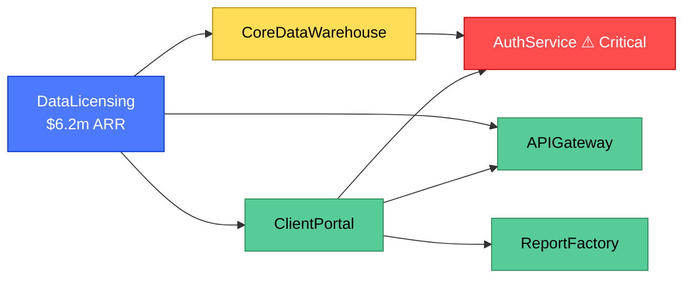

---

### MediaMeasurement — $5.1m ARR · Analytics

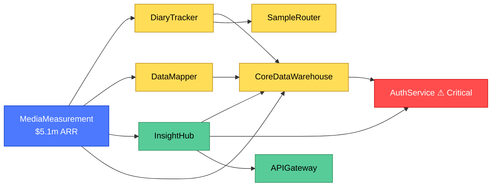

---

### RetailInsights — $4.6m ARR · Analytics

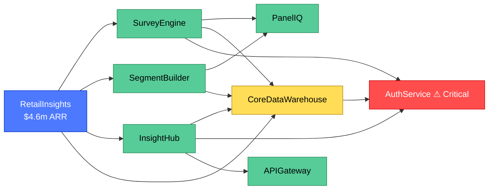

---

### BrandTracking Platform — $4.2m ARR · Analytics

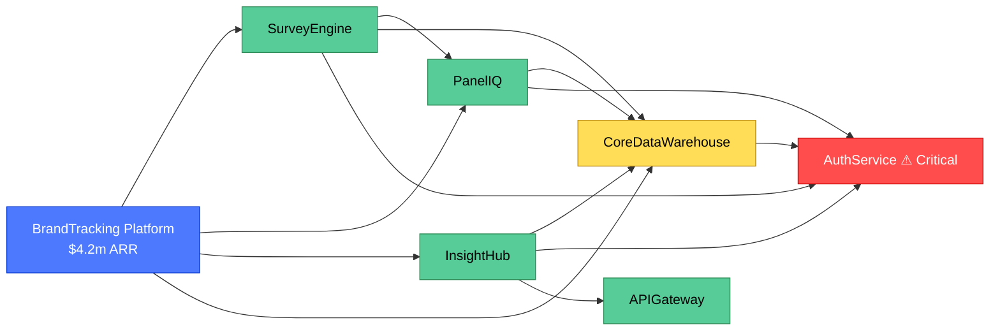

---

### CustomerSatisfaction Suite — $3.8m ARR · Analytics

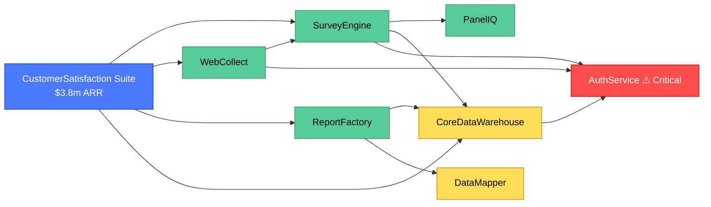

---

### ConsumerPanel — $3.4m ARR · Data Collection

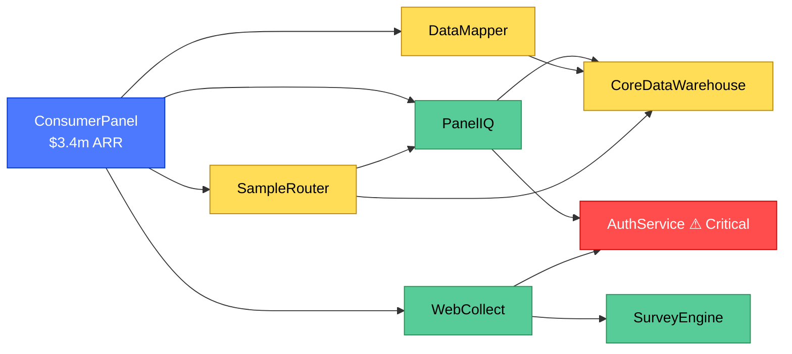

---

### TechnologyAdoption — $3.3m ARR · Analytics ⚠ Critical risk

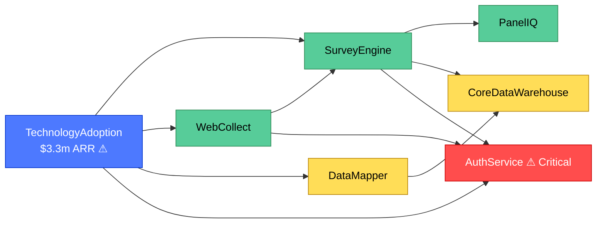

---

### AudienceAnalytics — $2.9m ARR · Analytics

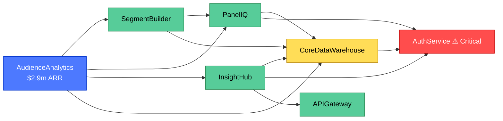

---

### HealthcareResearch — $2.7m ARR · Analytics

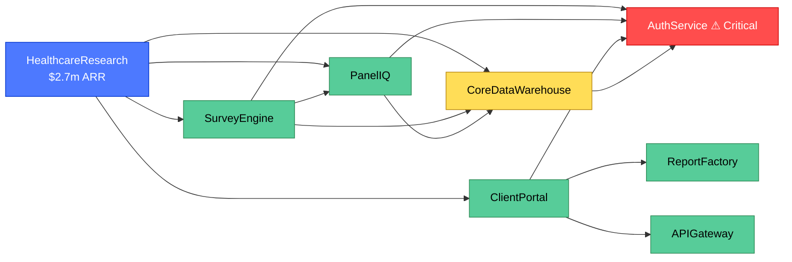

---

### CompetitiveIntelligence — $2.2m ARR · Analytics

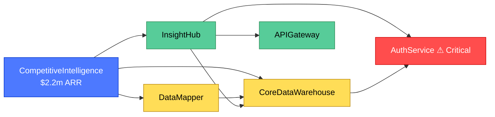

---

### LongitudinalStudies — $1.8m ARR · Data Collection

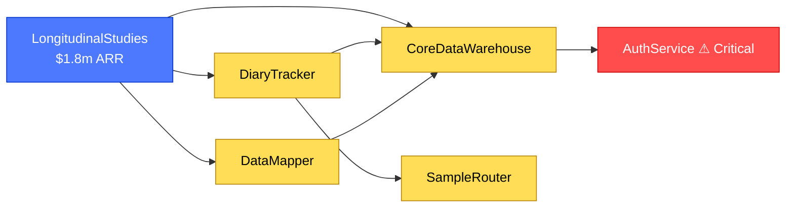

---

### FieldworkServices — $1.6m ARR · Data Collection ⚠ EOL dependency

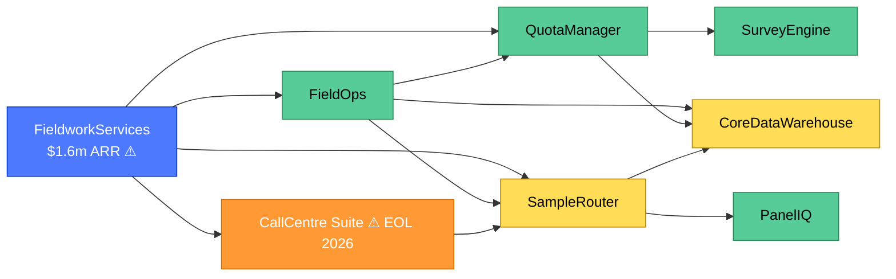

---

### PublicAffairsResearch — $1.1m ARR · Client Services

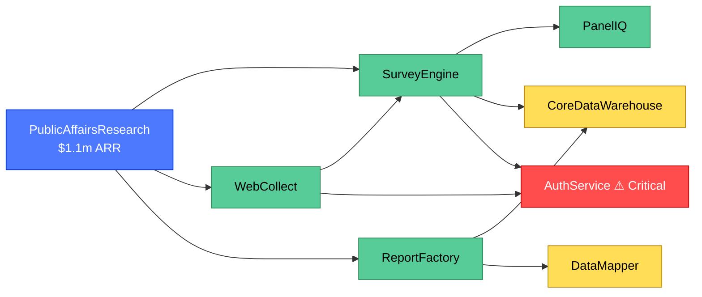

---

### CorporateReporting — $0.9m ARR · Client Services

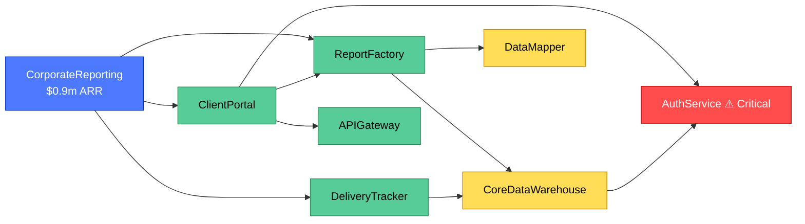

---

## Key risk chains

| Chain | ARR exposed | Why it matters |
|---|---|---|
| **AuthService** (Critical, vendor EOL Q2 2026) → directly used by 8 apps | — | Platform-wide blast radius if not replaced |
| **CoreDataWarehouse** → AuthService runtime dep | — | CDW write operations blocked if AuthService fails |
| **DataLicensing** → CoreDataWarehouse → AuthService (indirect) | **$6.2m** | Highest-revenue product exposed via two-hop dependency |
| **TechnologyAdoption** → AuthService (direct) | **$3.3m** | Direct Critical-risk exposure |
| **FieldworkServices** → CallCentre Suite (EOL 2026) | **$1.6m** | EOL dependency with no replacement plan |
| Total ARR with direct High/Critical exposure | **~$11.1m** | Including indirect DataLicensing chain |
